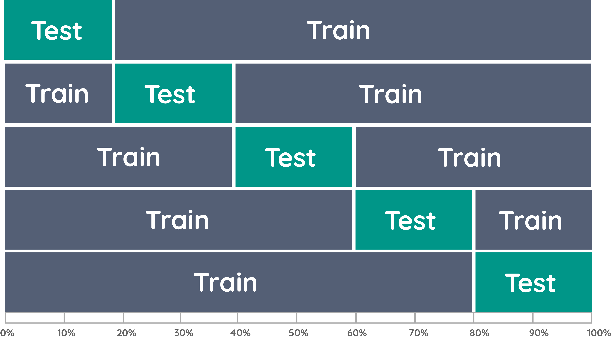

.. _crossval:

########
Crossval
########

**Advanced cross validation** is an important tool in machine learning that allows you to evaluate the quality of a model using a dataset that is split into multiple folds (sets) to train the model on one fold and test it on another. This allows you to measure how well the model generalizes to new data.

In the library, you can find many different tools and algorithms that allow you to perform cross-validation with extended functionality. They are presented in the form of libraries, modules and scripts that allow you to customize and run the cross-validation process depending on your needs.

    
---

  
Cross validation is a powerful tool for assessing the quality of machine learning models. However, when using cross-validation, the following problems may arise:
    - Choosing the number of folds can be tricky. If the number of folds is too small, then the estimation of the quality of the model may be inaccurate, and if the number of folds is too large, then training may take too long.
    - If the model is too complex, or if there is not enough data to train the model, then cross-validation can lead to overfitting of the model. This happens when the model is tuned to specific features of the training set that may not be representative of the general data population.
    - Some errors may occur when implementing cross-validation. For example, if the data is randomly divided into folds, the distribution of classes can be distorted, which can lead to an incorrect assessment of the quality of the model.
    
.. tip::
    
    Stratification is when we divide the data into subgroups so that each subgroup contains examples from each class in proportion to the overall proportion of classes in the dataset. This helps to get a more accurate machine learning model for imbalanced classes.
    

Basic Usage
===========

.. autoclass:: robusta.wrapper.WrappedRegressor
    :members:

.. autoclass:: robusta.outliers.SupervisedOutlierDetector
    :members:

.. autoclass:: robusta.resampler.PandasSampler
    :members:

.. autoclass:: robusta.outliers.OutlierDetector
    :members:
    
.. autoclass:: robusta.outliers.DividedOutlierDetector
    :members:

.. autoclass:: robusta.crossval.StratifiedGroupKFold
    :members:
